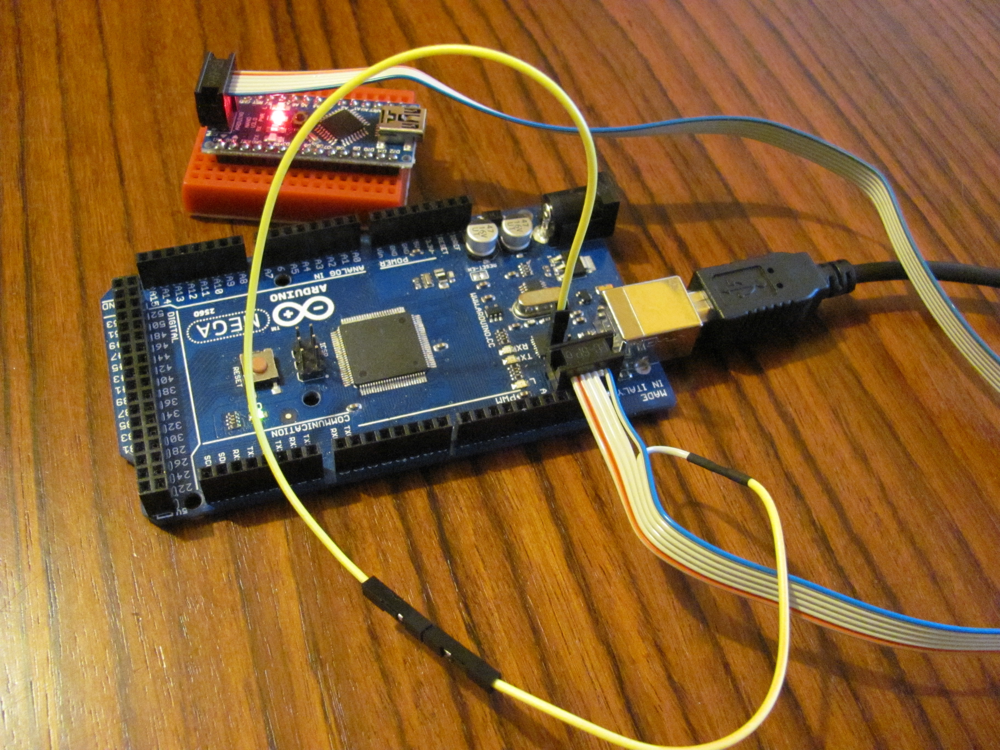

Arduino Hoodloader BETA 1.8
==================

This is the source page of the Hoodloader. The Hoodloader is a fully compatible replacement of the
normal 16u2 usbserial Bootloader. It can still work the same but has more functions.

### +++Checkout the new [HoodLoader2](https://github.com/NicoHood/HoodLoader2) which is a fully Arduino IDE compatible bootloader with custom programs and HID core as well.++

**Functions:**
* Program the Arduino Uno/Mega like you are used to
* Serial interface is still usable via USB!
* Use your Arduino as [HID device](https://github.com/NicoHood/HID)
* Use the 16u2 as ISP to reprogram your 328 and others
* One Firmware for Uno and Mega

**Tested Devices/OS:**
* Arduino Uno R3
* Arduino Mega R3
* Windows XP/7/8
* Linux: Ubuntu, TODO: Raspberry
* Android

**Limitations:**
* HID only works at baud 115200 (Software and speed limitation, see "how it works below")
* All other bauds work 100%. If you still try to use HID with other baud you will get weird output.
* 16u2 as ISP has the same functions/bugs like the normal Arduino as ISP. Use IDE 1.5.7!
* 8u2 has no ISP function (less flash, use Lite version)
* 4 pin header needs to be soldered for ISP and additional usage
* No more Midi/other stuff is possible due to DRAM, RAM and endpoint limitation
* 15 byte report, 15 report IDs max (by design)
* The 16u2 has very few bytes of ram which is very hard to develop with. ISP and Serial have to share the ram.

**Things that might change in the future:**
* Programming baud for ISP
* Gamepad reports
* 4 Pinheader functions
* Hoodloader Lite

Click here to get to the [HID library](https://github.com/NicoHood/HID).
See http://nicohood.wordpress.com/ for more tutorials and projects

Hoodloader Installation on Arduino Uno/Mega R3
==============================================
**For the whole Project IDE 1.5.7 or higher is recommended!**

**This tutorial is for Windows and R3 versions only.**
This method is called “Device Firmware Upgrade” and also works on Linux/Mac and older versions but its not explained in this article.
Maybe [this](http://arduino.cc/en/pmwiki.php?n=Hacking/DFUProgramming8U2) or
[this page](http://arduino.cc/en/Hacking/Upgrading16U2Due) can help you.
If you have a 8u2 see instructions below the DFU tutorial.

**What you need: Arduino Uno/Mega, USB Cable, a normal wire, [Flip with Java](http://www.atmel.com/tools/flip.aspx)**

Flashing new Firmware with DFU and Flip
---------------------------------------

To **install the new bootloader** connect your Arduino to your PC and put it into DFU mode.
**You can always switch back to the original firmware, nothing to break.**

**Install [Flip with Java](http://www.atmel.com/tools/flip.aspx)** first.
This will also install the needed DFU drivers to flash the new firmware. Start Flip.

**_Briefly_ short these two pins** of the 16u2 with a Wire **(the jumper is only to show the connection)**.
If you have an older Version than the R3 please google how to get in DFU mode.
Today everybody should have an R3 so no resistor and complicated stuff is needed.


The device should now show up as Atmega16u2 in the device manager.
If not or if you get Error: **“AtLibUsbDfu.dll not found”** install the drivers manually from the device manager.
Right click the unknown device and select the Flip installation path to search the drivers.
C:\Program Files (x86)\Atmel\Flip 3.4.7\usb rightclick the .inf file and hit install!

Click the IC Button an select **Atmega16u2. (same for Uno/Mega).**


**Click File->Load Hex File** and select the Firmware Hoodloader1_x.hex
(Dev versions on dev branch in avr/firmwares/Hoodloader/Hoodloader.hex)
**Its the same file for Uno and Mega.**


Click the USB Cable and **click open.**


**Click run** to upload the firmware. Uncheck Reset and click Start Application to restart your Arduino. Or just **replug the cable.**
Read further on how to install the drivers for Windows.

Installation on a 8u2
---------------------
The 8u2 has less flash so you are not able to flash the normal Hoodloader.
Instead there is a Lite Version in Firmwares/LegacyVersions/
You need to flash this with an ISP because it will overwrite DFU.
The DFU Bootloader takes 2 or 4kb (not sure) and the hex file is >6kb anyways.
This is only for advanced useres with older chips.
HID is fully functional, ISP wont work.

CDC Driver installation
-----------------------
**You need to install new drivers for the new device on Windows (Linux, Mac not needed).** Actually they are not new, its just an .inf file that tells
Windows to use its built in CDC Serial driver. Ironically Microsoft never signed its own driver.
The drivers are located in Firmwares/Hoodloader.inf.
Also see [this tutorial](http://arduino.cc/en/guide/windows) on how to install the drivers (rightclick the .inf file and hit install).
[How to install drivers for Windows 8/8.1](https://learn.sparkfun.com/tutorials/disabling-driver-signature-on-windows-8/disabling-signed-driver-enforcement-on-windows-8).

If you want it to be recognized as Uno/Mega edit the makefile and recompile. I dont recommend this to know what
Bootloader currently is on your Board. It seems that with the signed drivers HID wont work with official PIDs.

You are done! Have fun with your new Arduino Firmware.

Updating to a newer Version
===========================
HID library:

To upgrade to v1.8 you need to redownload the Arduino IDE files, restore the original files and install the library like you are used to.
You library is now located in sketchbook/libraries/HID/<files>
Its now way easier to install the library, no need to replace system files. For further releases just replace all files again.

**Restart the IDE**

Hoodloader:

Just upload the new hex file and check the HID Project if the HID library code has changed and replace the new files too.
You normally dont need to reinstall the drivers for windows if the changelog dosnt note anything.
Versions below 1.5 might need the new drivers.

Usage
=====

Overview of the pins on a normal Arduino Mega:


HID usage
---------
See the [HID project](https://github.com/NicoHood/HID)
for changelog, bugs, installing instructions and more information of the main feature.
It contains an easy to use API for all HID functions and examples for each device.

Deactivate HID function
-----------------------
Its possible to deactivate HID if you messed up something in the code and cannot return easily.

Short PB5 (next to AREF pin) of the 4 pin header to gnd to deactivate HID usage. You need to solder the pin header of course.

Deactivate auto reset function
------------------------------
Its possible to deactivate auto reset if you dont want to restart the MCU when opening the Serial.

Short PB6 (closest pin to the power plug) of the 4 pin header to gnd to deactivate auto reset. You need to solder the pin header of course.
See picture above where PB6 is located.

16u2 as ISP usage
-----------------
The Hoodloader includes a port of the Arduino as ISP sketch. Some minor code style changes and improvements were made but overall it works the same.
No need to flash the main processor with the sketch, the 16u2 can work as ISP.

Copy the folder (Hoodloader-master) into sketchbook/hardware/ like this: sketchbook/hardware/Hoodloader/avr/[...]

**You need to solder the 4 Pin Header. SS pin is currently on PB4, It is the pin on the bottom left (closest to the TX led).
See picture above.**

At the moment I use baud 1 (which is normally invalid) to upload sketches. This is to not interfere with any other baud.
This gives us most compatibility. Under Windows this works, tell me about other systems.
Otherwise I have to use 300 or something similar.

**Use IDE 1.5.7** for 16u2 as ISP. It fixes a verification bug for burning the Mega bootloader.

Uploading via Programmer on Mega2560 is broken due to fuse settings. Select Arduino Mega ISP fix in the Board menu
and burn the Bootloader. This is a workaround to set the BOOTRST fuse. Once you did that you can use the uploading via programmer function.
This reason for this bug ist still not clear.

See these threads:

http://forum.arduino.cc/index.php?topic=126160.0

https://github.com/arduino/Arduino/issues/388#issuecomment-53134423

TX Led is for status, RX Led for errors.
Please also report me other errors related to ISP.

Wiring: Connect all lines together like this:
```
16u2 - Chip being programmed
5V   - 5V
GND  - GND
MOSI - MOSI
MISO - MISO
SCK  - SCK
SS   - RESET
```

If you are programming the main MCU only MOSI, MISO, SCK, SS is required to connect.


[See Google code discussion](https://groups.google.com/a/arduino.cc/forum/#!topic/developers/V_T-Uvj8hSs)

How it works
============
For the Uno/Mega you need a special Bootloader. Why? See [Hoodloader repository](https://github.com/NicoHood/Hoodloader).
To sum it up: Serial information is grabbed by the "man in the middle, 16u2" and you dont have to worry to get any wrong Serial stuff via USB.
Thatswhy you need a special baud (115200) that both sides can communicate with each other.
Every USB command is send via a special [NicoHood Protocol](https://github.com/NicoHood/NicoHoodProtocol)
that's filtered out by the 16u2. If you use Serial0 for extern devices it cannot filter the signal of course.
You can still use the NHP, just dont use the reserved Address 1.

The Uno/Mega has 2 chips on board.
The 328/2560 and a 16u2 on each. And the only communication between the 16u2 and the main chip is possible via Serial0.
But the Serial is also used to program the chip. So what I do here is to filter out all Serial Data that comes in
via the NicoHoodProtocol (NHP). There is an indicator address 1 which contains the beginning mark and the Report ID.
If the following Serial information is Address 2,3 a.s.o with a valid checksum the report will be created and sent if it
finished successful. If any error occurred within the first 2 Protocol Addresses the information will be sent via Serial.
The programm assumes the start mark was outside the protocol/HID function.The program should forward this information because
it could be a normal information. Everything above 2 Addresses that goes
suddenly wrong wont be sent and discarded due to a normal wrong HID report. Normally you dont have to worry about getting weird HID
presses. You need to send exactly 6 bytes with the special numbers and another 6 bytes for the first information with checksum
and complete the full report with even more addresses and no timeout. You might get weird Serial output if you hit the exact 12 bytes
without timeout of a few milliseconds. This is nearly impossible.
And if the reading timed out the data will also be forwarded. And if you only send Ascii Code the Information is forwarded instantly
because the NHP filters that out instantly (see documentation of the NHP). So filtering should be fine and dont block :)

Just an excerpt (better explanation soon):
```
There are 3 modes: Default (usb to serial), HID, and ISP
to distinguish between ISP and the others there is a simple way of doing it: The CDC Virtual Serial interface can have different baud rates.
and the MCU know this baud, because it needs to reprogram the chip. So what i did was to use an invalid baud (1) to say "hey, its programming mode"
this will turn off usbtoserial and HID. this will set the ram up for ISP mode. this will deactivate any incoming Serial byte (discard)
to with baud 1 iso mode is called any every received byte is translated as stk500v1 command
thats the ISP part
the HID - DEFAULT part is also easy
HID only works at baud 0 and baud 115200
baud 0 is when the MCU started, so no baud was set with the pc
baud 115200 is set after programming. thatswhy i had to use 115200. luckly its the fastest baud, for faster reports.
so its the best thing that could happen ;)
if its not baud 0, 115200 or the HID is deactivated (which might get removed) it will be in normal mode
it will translater usb to serial and serial to usb byte by byte
HID mode is a bit different. PC->328 for example works the same
but 328->PC is filtered. the 16u2 listens for NHP (Nicohoodprotocol) commands with a special pattern and filters this out.
therefore i buff every possible command. If its valid it will send the HID report. this is very save, its very unlikly
that you will ever produce a valid HID report with random data. also normal ASCII is always filtered out, due to protocol specification
and if a possible valid protocol times out the data is also send to the pc to not keep the last bytes
```

The 16u2 as ISP works like the Arduino sketch. It just uses its won SPI header to program the device
and uses a special CDC baud to not get into conflict with other commonly used bauds.
In ISP mode no data is transferred between Arduino main MCU and 16u2. This also wouldnt be possible because of shared ram.
The ISP function has the same bugs like the normal Arduino as ISP sektch. It might have some improvements though.

This library wouldnt be possible without
========================================

* [Lufa 140302 from Dean Camera](http://www.fourwalledcubicle.com/LUFA.php)
* [Darran's HID Projects] (https://github.com/harlequin-tech/arduino-usb)
* [Connor's Joystick for the Leonardo](http://www.imaginaryindustries.com/blog/?p=80)
* [Stefan Jones Multimedia Keys Example](http://stefanjones.ca/blog/arduino-leonardo-remote-multimedia-keys/)
* [Athanasios Douitsis Multimedia Keys Example](https://github.com/aduitsis/ardumultimedia)
* [The Original Arduino Sources](https://github.com/arduino/Arduino/tree/master/hardware/arduino/firmwares/atmegaxxu2/arduino-usbserial)
* [USBlyzer](http://www.usblyzer.com/)
* [Arduino as ISP](https://github.com/rsbohn/ArduinoISP)
* A lot of searching through the web
* The awesome official Arduino IRC chat!
* [The NicoHood Protocol ^.^](https://github.com/NicoHood/NicoHoodProtocol)
* For donations please contact me on my blog :)

### +++Checkout the new [HoodLoader2](https://github.com/NicoHood/HoodLoader2) which is a fully Arduino IDE compatible bootloader with custom programs and HID core as well.++

Known Bugs
==========
See the [HID project](https://github.com/NicoHood/HID) for HID related bugs.

System Wakeup is currently not working
System Shutdown is only working on Windows systems.

**Programming Arduino Mega with ISP needs a fix (see tutorial above).**
See this for more information + fix: http://forum.arduino.cc/index.php?topic=126160.0

On a Raspberry Pi is a problem, because it opens Serial at baud 9600 by default which disables HID.

Media Keys dont work on Linux out of the box (not a Hoodloader problem, this is with any Keyboard)

See this how to uninstall the drivers for Windows if something isnt working: https://support.microsoft.com/kb/315539

Burning Bootloader error is fixed with IDE 1.5.7 or higher (avrdude bug)!

Using the Hoodloader on a 8u2 you need to use the Lite Version and DFU wont work.

It seems you cannot use the official VID/PID with HID due to signed drivers!?

Feel free to open an Issue on Github if you find a bug. Or message me via my [blog](http://nicohood.wordpress.com/)!

Ideas for the future (Todo list):
=====================
* (Design new Arduino(shield?) with I2C and SPI connection)
* general timeout function for hid and Pmode timeout!
* remove TODO <-- stuff
* explain how it works better
* Add phone control/flight simulator control (anyone who needs it?)
* Add more devices (even more?)
* Add Midi (no more free Endpoints)
* Add Led/SPI support (discarded, not needed, too slow)
* Add HID rumble support (very hard)
* Add Xbox Support (too hard)
* Add Report Out function (for Keyboard Leds etc, maybe the 4 pin header?)
* get Raw HID working
* new dfu loader to reset 16u2 easier
* reduce flash if possible
* improve ISP if possible
* access eeprom
* adding more examples?
* add better pictures
* isp cdc send better
* led timeout timer interrupt?

Planned for 1.9:
* remove checksum for NHP on data to speed thing up
* compile for different drivers/ids (problem with official pids) <-- problem with hid
* motion wakeup, for reactivating from sleep on windows
* HID on raspberry: slower
* fix ubuntu gamepad bug
* Add Hoodloader Lite again

Version History
===============
```
1.8.0 Beta Release (26.08.2014)
* Improved ram usage
 * Move stable with more free ram
 * saved more than 100 bytes of ram
 * changed some variables/structs
 * ISP flash chunk fix saved a lot of flash
 * Separated NHP from ram
* Improved HID functions
 * Fixed Ubuntu HID Descriptor problem
 * This also fixed a Media Keys bug
 * Changed HID EP Size to 16 to have more DPRAM
 * Added automated clear report function on reset
 * HID working after ISP programming
 * Moved HID deactivation function to PB5 (next to AREF PIN)
 * Fixed Gamepad 1+2 HID report bug on Linux
 * Fixed Media Keys bug -> HID now working under Linux
 * Reworked HID library completly
 * Reduced Gamepad z axis to 8 bit
 * Gamepad center is now at zero. (signed int/char)
 * Replaced Joysticks with Gamepads
* Improved ISP functions
 * Takes less flash
 * Cleared code, ordered functions
 * Added flash chunks to save more ram
 * Added Mega Upload fix
* Fixed programming bug on slow PCs (1.6 - 1.7.3)
* Cutted huge main file into libraries
* Fixed bugs in Serial Buffer + rewrote the lib with new functions
* Reworked NHP
* Sketchbook hardware folder compatibel
* Auto reset deactivation possible
* Hoodloader Lite not possible anymore, too much flash used
* Fixed PC restart Bug

1.7.3 Beta Release (10.08.2014)
* Fixed HID flush bug (1.6 - 1.7.2)

1.7.2 Beta Release (10.08.2014)
* Added Lite version for 8u2
* Added Versions that show up as Uno/Mega (not recommended)
* Makefile and structure changes

1.7.1 Beta Release (10.08.2014)
* Fixed HID deactivation bug

1.7 Beta Release (10.08.2014)
* Works as ISP now.
* Exceeded 8kb limit. For flashing a 8u2 use Lite Version please!
* Changed Readme text

1.6 Beta Release (09.08.2014)
* Changed HID management (not blocking that much, faster)
* added RawHID in/out (HID to Serial)

1.5 Beta Release (21.07.2014)
* Moved Hoodloader source from [HID project](https://github.com/NicoHood/HID) here
* Overall a lot of ram improvements, now with a big global union of ram
* Removed USBtoUSART buffer (not needed, saved 128/500 bytes)
* Removed Lite version because of better ram usage not needed
* Separated different modes better to not cause any errors in default mode
* Improved the deactivate option
* Integrated NHP directly
* Replaced LightweightRingbuffer with native Lufa Ringbuffer
* Improved writing to CDC Host
* Fixed a bug in checkNHPProtocol: & needs to be a ==
* General structure changes
* Improved stability
* Fixed Arduino as ISP bug (same as in v1.4.2)

1.4.2 Beta Release (10.07.2014)
* Fix for Arduino as ISP

1.4 Beta Release (10.07.2014)
* Added Lite Version with less ram usage
* Changed PIDs, edited driver file
* added Tutorials

1.3 Beta Release (01.07.2014)
* Improved ram usage (you can get even better but that messes up code and increases flash)

1.2 Beta Release (22.06.2014)
* Sometimes HID Devices weren't updating when using more than 1 Device (set forcewrite to true)
* Fast updates crashed the bootloader (too much ram usage, set CDC buffer from 128b to 100b each)
* Minor file structure changes

1.1 Beta Release (05.06.2014)
* Minor fixes

1.0 Beta Release (03.06.2014)
```

For Developers
==============
If you deactivate some reports it can occur that windows will cause problems and recognize it as different device.
While developing I had that much trouble that I had to change the PID. No way to repair the broken windows driver settings.
So be careful if you change the source on your own with important PIDs.
Therefore reinstall the divers for any device or just dont touch the HID reports in the Bootloader.
The Leonardo/Micro version worked fine till now.

It seems you cannot use the official VID/PID with HID due to signed drivers!?

See this how to uninstall the drivers:
https://support.microsoft.com/kb/315539

The Hoodloader was coded with Windows7/8.1 + Visual Studio Express and compiled with a Raspberry Pi.
Lufa version 140302 is included!

```
#Vendor ID from lufa         0x03EB
#Product ID created my own
#HOODLOADER                  0x6E68
#HOODLOADER-Lite             0x4E48

#You can also use the native Arduino VID and PID
#VendorID  Arduino           0x2341
#ProductID Arduino Uno       0x0001, 0x0043 R3
#ProductID Arduino Mega2560  0x0010, 0x0042 R3
#ProductID Arduino Mega ADK  0x003F, 0x0044 R3

#define RAWHID_USAGE_PAGE	0xFFC0 // recommended: 0xFF00 to 0xFFFF
#define RAWHID_USAGE		0x0C00 // recommended: 0x0100 to 0xFFFF
#define RAWHID_TX_SIZE 63 // 1 byte for report ID
#define RAWHID_RX_SIZE 63 // 1 byte for report ID
```

How to compile (on a Raspberry Pi)
==================================
This instruction is for a Raspberry Pi with Debian. I cannot tell you how to compile Lufa with any other device, but Google can.

I recommend creating a Windows share by right clicking your Arduino folder and hit "share".
Then you can edit the files on Windows with your default code editor and connect to your pi via ssh.
``` bash
$ cd Desktop
$ mkdir Arduino

#Test mounting:
sudo mount -t cifs -o username=yourusername,password=yourpass,nounix,noserverino //YOUR-PC-NAME/Arduino Arduino

#run it automated at startup. If not connected this will cause a long timeout.
sudo nano /etc/fstab
//YOUR-PC-NAME/Arduino /home/pi/Desktop/Arduino cifs username=yourusername,password=yourpass,nounix,noserverino 0 0
```

You need to install the gcc-avr toolchain, avr-libc and compile with:
``` bash
$ sudo apt-get install gcc-avr avr-libc
$ cd Desktop/Arduino/Hoodloader
$ sudo make clean
$ sudo make
```

**With not enough ram the Hoodloader wont work. My worst limit was 339/323 bytes used.
This depends on the PC, some faster PCs can handle USB better so you can use more ram.**

Licence and Copyright
=====================
If you use this library for any cool project let me know!

```
Copyright (c) 2014 NicoHood
See the readme for credit to other people.

Permission is hereby granted, free of charge, to any person obtaining a copy
of this software and associated documentation files (the "Software"), to deal
in the Software without restriction, including without limitation the rights
to use, copy, modify, merge, publish, distribute, sublicense, and/or sell
copies of the Software, and to permit persons to whom the Software is
furnished to do so, subject to the following conditions:

The above copyright notice and this permission notice shall be included in
all copies or substantial portions of the Software.

THE SOFTWARE IS PROVIDED "AS IS", WITHOUT WARRANTY OF ANY KIND, EXPRESS OR
IMPLIED, INCLUDING BUT NOT LIMITED TO THE WARRANTIES OF MERCHANTABILITY,
FITNESS FOR A PARTICULAR PURPOSE AND NONINFRINGEMENT. IN NO EVENT SHALL THE
AUTHORS OR COPYRIGHT HOLDERS BE LIABLE FOR ANY CLAIM, DAMAGES OR OTHER
LIABILITY, WHETHER IN AN ACTION OF CONTRACT, TORT OR OTHERWISE, ARISING FROM,
OUT OF OR IN CONNECTION WITH THE SOFTWARE OR THE USE OR OTHER DEALINGS IN
THE SOFTWARE.
```
